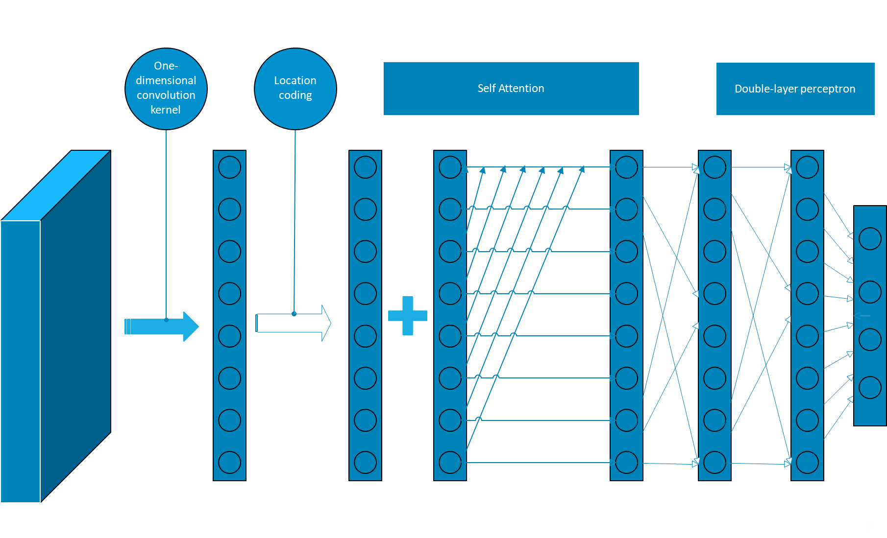
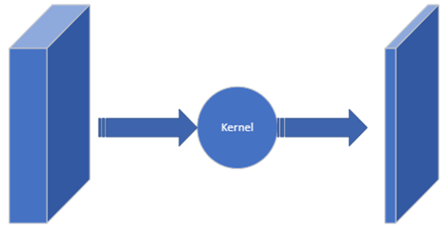
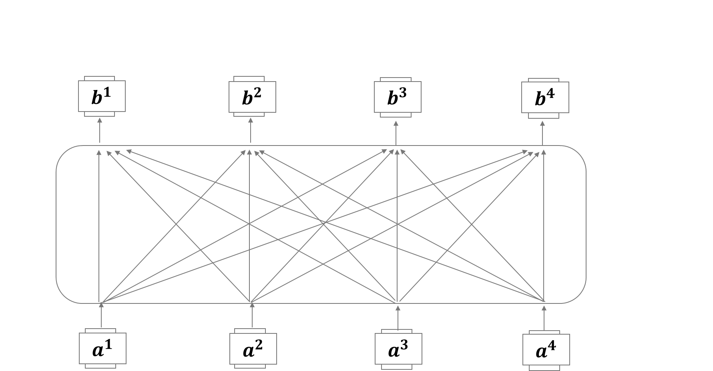
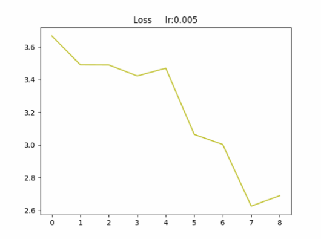
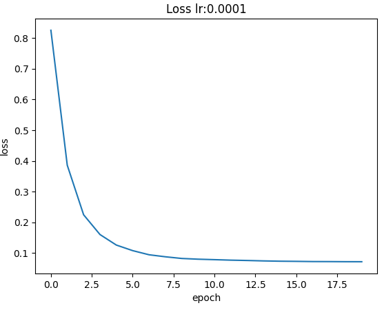
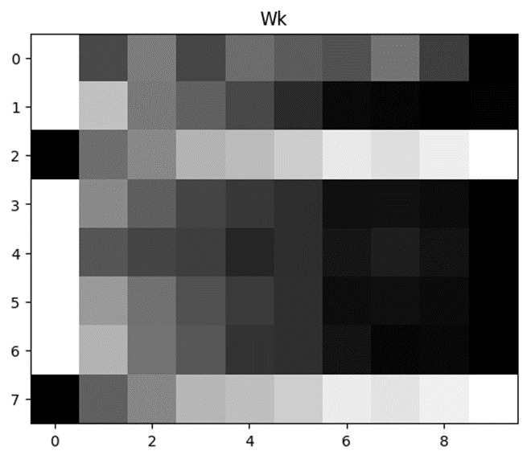
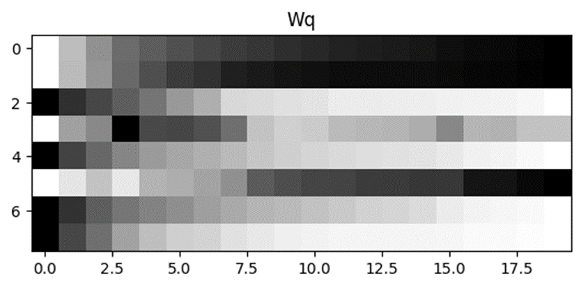
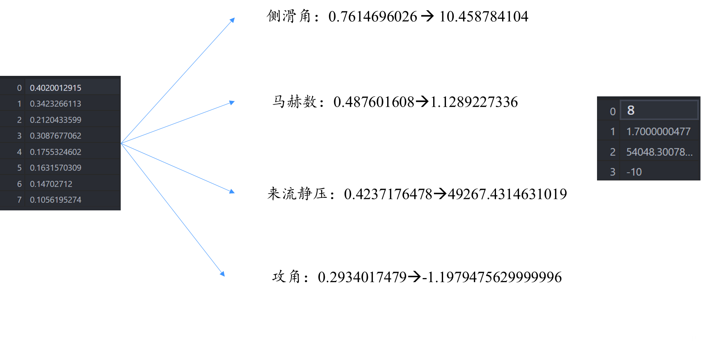
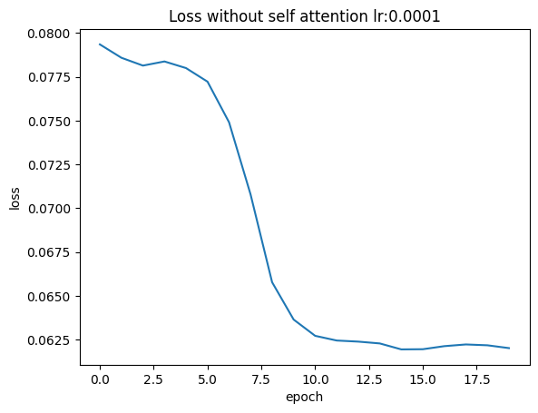
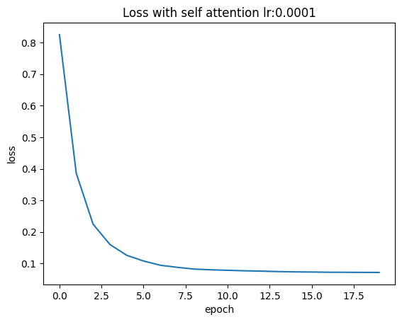

# 嵌入式大气数据预测

## 一、问题描述

​	关于嵌入式大气数据预测的背景,可以概括以下几点:

1. 嵌入式系统在军事、民用等众多领域都有广泛应用,需要根据大气环境实时调整系统参数,提高系统可靠性和使用效率。

2. 随着物联网、边缘计算等技术的发展,嵌入式系统具有更强的分布式部署和协作计算能力。这使得嵌入式系统可以部署更多环境传感设备,收集大量大气数据。

3. 深度学习、神经网络等AI技术的进步,为嵌入式系统提供了更好的大气数据分析和预测能力。嵌入式AI芯片的出现,进一步推动了嵌入式智能化。

4. 5G等新型宽带无线通信技术为嵌入式系统的分布式布局提供了通信保障。使嵌入式系统可以构建实时、动态的大气环境 。

5. 大数据分析技术的发展为嵌入式大气预测系统提供了海量异构大气数据的整合分析能力。

6. 嵌入式大气预测系统还需要考虑成本、功耗等约束条件。同时需要解决数据安全、系统可靠性等问题。

​	具体到飞行器领域，嵌入式大气数据预测系统还有以下突出功能:

1. 可以获取飞行器上的各种气象传感器数据,如温度、湿度、气压等,并结合卫星云图、气象雷达等外部大气数据进行综合分析。
2. 利用机器学习算法建立大气环境数字孪生模型,进行风速、湿度、积冰区等参数的预测,为飞行控制提供支持。
3. 可以部署在无人机等低成本飞行平台上,实现自主气象感知和避难。无人机还可以协同构建三维大气环境模型。
4. 大气预测可以评估飞行安全风险,进行航线规划优化。例如绕开积冰区或气流涡流区等。
5. 预测空中湍流、垂直风切变等参数,优化飞行控制参数,实现顺风飞行,降低燃油消耗。
6. 针对高超声速飞行,需要预测高空大气环境参数,进行空气动力学与飞行动力学的协同控制。
7. 预测闪电风暴等情况,提前规划避雷航线。也可以用于天气修改系统的气象控制。
8. 预测飞行过程中的积冰情况,优化除冰系统的策略。

​	本文基于自注意力层和感知机模型，建立了由八个测压点到四个参数——侧滑角、马赫数、来流静压、攻角的简单模型。

## 二、文献调研

[1^]: Redmon, Joseph, et al. “You only look once: Unified, real-time object detection.” Proceedings of the IEEE conference on computer vision and pattern recognition. 2016.

[2^]: 许潘. 嵌入式大气数据系统神经网络技术及应用研究[D].南京航空航天大学,2014.

[3^]: Susanne Weiss. Comparing three algorithms for modeling flush air data systems[C].40th AerospaceSciences Meeting & Exhibit, Nevada, 2002.

## 三、神经网络

### 3.1 一维卷积层

​	卷积层使用$1\times1$卷积核，主要承担以下任务：

1. 提升计算效率:$1\times1$卷积核可以在不改变特征图大小的情况下减少网络参数量和计算量。它可以在两个较大的卷积层之间加入,起到“通道数调整”的作用。
2. 增加非线性能力:$1\times1$卷积核本身就带有非线性激活函数,可以增加网络表达能力,有利于学习更复杂的特征表示。

​	之所以不选择带有视野的卷积核，是因为自注意力层已经承担了相关性计算的任务，出于减小计算量的考虑，采用了$1\times1$卷积核。

### 3.2 自注意力层

​	自注意力层(Self-Attention Layer)是注意力机制在深度学习中很重要的一个组件，它的主要思想是允许模型学习到序列中不同位置间的相关性,以此来获取序列的高级语义特征表示。

​	自注意力层的计算过程主要分为以下几步:

1. 对输入序列进行线性映射,得到QUERY、KEY、VALUE三个向量序列。
2. 计算QUERY和KEY的点积相似度,通过Softmax归一化得到注意力分布。这反映了Query与Key之间的相关性。
3. 根据注意力分布,对VALUE进行加权求和,作为最终的自注意力输出。
4. 注意力输出可再过线性层等后处理,然后与序列其他特征一起表示最终语义。

​	该网络采用自注意力层主要是考虑到各测压点之间可能的相关性。

### 3.3 感知机模型

​	感知机(Perceptron)是一种简单而典型的神经网络模型,是多层前馈神经网络的雏形,常被用于介绍神经网络的基本概念。

​	感知机的主要特点包括：

1. 作为神经网络的基本组成单元。多层感知机就是由多个感知机单元通过前向后向传播算法堆叠而成。
2. 模型解释能力。使用感知机模型可以解释和理解神经网络中权重、偏置、激活函数等的作用。
3. 模型调试。使用感知机模型可以隔离和测试神经网络中的单个或几个神经元的行为。
4. 算法测试。可以使用感知机模型来测试神经网络的前向传播、反向传播等算法实现的正确性。
5. 权重初始化。感知机模型可以给出神经网络权重矩阵合理的初始化方案。

## 四、训练情况

### 4.1 均方误差损失函数

​	当学习率较大时，尽管损失值仍然有减小的趋势，但会出现波动的情况，且在随机选取训练样本的情况下稳定性较差。

​	减小学习率后、增加训练轮数以后，损失值的变化明显更加稳定。

**总结：**

-学习率(lr) :   太大会导致Loss波动

-批次大小(Batch) :  太小会导致训练时间太长

### 4.2  可学习参数变化情况

​	以自注意力层中的QUERY、KEY为例：

​	KEY是长度为8的一维向量，图例中从左向右代表了8个参数的变化情况，观察发现其数值均在趋向于稳定：

观察发现，当轮数增加达到一定次数时，参数值就会达到稳定状态：

## 五、测试结果

​	左侧为归一化后的八个测压点输入情况，输出四个预测值，经过反归一化后得到四个标准预测值，与最右侧的标准值对比。

## 六、网络比较

### 6.1 **双层感知机** **VS** **双层感知机+自注意力**

​	在仅使用双层感知机时，损失值在小学习率的情况下仍会出现波动，且较难趋于稳定：

​	在增加了自注意力层后，损失值在一定程度上消除了波动，而且下降速度快，多次训练表现稳定：

**总结：**

-网络稳定性： 加入自注意力层后，网络明显更加稳定

-残差损失： 残差损失波动更小，下降变快

-训练速度： 加入自注意力层后，训练速度略微下降
